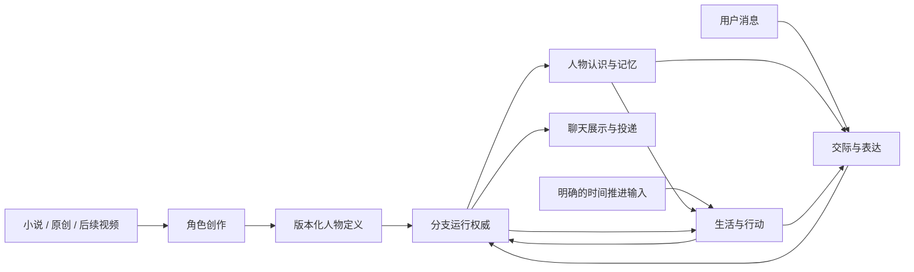

# 角色聊天产品：整体目的、能力与目标架构

2026-09-24，Slice-75全局复盘。状态：**有依据的目标方案，尚未实施重构**。产品决定以PRODUCT及[用户方向记录](character-chat-direction.md)为准；本文统合后续主线，不覆盖现行运行契约或扩大数据授权。研究依据见[全局研究记录](../research/2026-09-24-global-character-system.md)，具体知识组织见[专题纠偏](../research/2026-09-24-character-knowledge-hierarchy.md)。

## 1. 目的：用户最终得到什么

一个以聊天为主的本地优先软件：从小说、后续动画视频或原创设定创建虚拟人物，选择故事起点与世界模式；像认识网友一样开始交流，此后对方保持自己的经历、立场、关系和关注，有能接续的生活，也会在合适时候分享。

目标不是原作百科答题器、通用任务助手、永久扮演固定语气的提示词，或宣称人工意识。用户需要感受到：她知道自己是谁；有理由这样理解和回应；昨天成立的事情今天仍成立；不围着用户临时编人生。软件应允许查看依据和纠错，但正常聊天不要求读工程诊断。

### 从目的推导的必要条件

1. **同一人物**：核心认识相对稳定，情境可变；职业、关系与经历互相联系，不能只靠名字/形容词。
2. **有限视角**：世界真实、角色相信、角色已知、向用户透露过的信息各不相同；误会也应有来源与可修正过程。
3. **有缘由的行动**：关注、能力、约束和已发生事情能解释下一步；有计划不等于已经完成。
4. **持续性**：原作起点与分支新增事件各有权威记录；回复只是表达，不能自行证明事件。
5. **共同交流**：两人有清楚的联系方式与相识过程；理解、信任、披露来自实际互动，不随用户一句话全部改写。
6. **能长期运行**：重启、失败、预算、暂停和身份切换不破坏上述体验；成本/延迟必须进入验收。

这些条件推导出下面的职责，不要求照搬人脑或一套心理理论。

## 2. 完整功能与优先级

| 用户能力 | 必须真正发生的处理 | 首版/后续及完成证据 |
| --- | --- | --- |
| 小说导入建角 | 解析卷章与版本，分场景/人物/关系，提取候选，辨别说话者与知情时序，组织人物定义，显示重要冲突供简明确认 | 首版；换一本材料仍可执行，不靠纱雾专用脚本；缺资料可继续有限创建，不能伪报完整 |
| 原创人物制作 | 接受用户已有设定或有目的的补问；区分明确设定、助手补充、未定内容，复用同一人物定义格式 | 首版入口；用户只确认关键新增设定，不被要求逐条审核内部字段 |
| 起点与世界选择 | 选择阶段；保留既往，默认允许此后分支；严格原剧情单独模式；分支未来不自动照搬原作 | 起点/默认分支首版；严格模式需另验冲突裁决，UI未实现时明确不可用 |
| 自然聊天与自主立场 | 识别交际目的，选适用认识/经历，决定回应/澄清/保留/换题，整体表达 | 首版；跨领域改写不靠菜单；能接住“都可以”，也能合理不同意 |
| 关系和共同记忆 | 记录实际交谈与披露，形成有依据的关系认识；跨重启/话题接续；错误旧回复不覆盖原作 | 首版最小闭环；恢复同一身份，不需用户重复介绍；撤回含义明确 |
| 自己的生活与喜怒哀乐 | 关注形成有限活动；活动提议经校验成为事件；事件对目标的意义形成有缘由的短期反应 | 完整小成品需至少一种真实闭环活动；不是随机近况或只改心情数值 |
| 主动分享 | 判断是否有值得分享的事、愿不愿讲、适不适合此刻讲，再投递 | 完整小成品需一次真实路径；默认每天最多2次新话题、非配额，可关闭/暂停，不催促未回者 |
| 资料/数据/运行控制 | 查看依据、修正草稿、身份隔离、暂停生活、删除/撤回、成本与失败状态可理解 | 随各能力同时交付，不留给末尾补救 |
| 动画视频建角 | 字幕/ASR、画面/OCR/镜头与人物对应、跨模态冲突、时间码证据，进入同一来源流程 | 后续；先验证短场景归属，不能把有字幕当已理解视频；具体模型/数据用途另行落实 |
| 不同世界/更多角色 | 明确新的世界规则与设定归属，复用人物和分支机制 | 后续；不在首版构建全社会仿真或无限工具行动 |

“基础聊天版”可先于生活完成交付，但必须这样命名；用户完整愿景包含生活与主动联系，不能把它们永久移到计划尽头。

## 3. 架构由三个闭环组成

图为逻辑职责，不是六个微服务、六个Agent或新增数据库。仍只有ApplicationFacade是产品业务Interface，open_local_product负责正式装配；模型任务统一经ModelGateway。

### 3.1 从资料到人物

资料导入 → 场景/角色/版本定位 → 候选事实和经历 → 语义/时序/知情核对 → 核心认识、经历脉络和条件化表达材料 → 起点投影 → 用户简明确认关键不确定与分支配置 → 封存人物定义版本 → 新分支身份。

- 最小来源单位是可理解的场景，同时保留句段证据用于纠错；人物未出场但合理获知的信息需明确获知途径，不能靠共现猜测。
- 系统负责自动整理和筛查，用户只处理关键冲突/偏好/权利用途，不能把“自动导入”实现成无限人工标注。
- 提取失败保留可恢复进度及缺口；不将未抽到解释为人物不知道。不因少数未知禁止一切聊天，也不伪装完整。
- 原创内容没有小说出处，可标用户作者设定；助手补充单独确认。视频只增加输入Adapter，不另造一套人格运行逻辑。
- 建角后发现原作误识：修订草稿并生成新定义版本，已有分支继续绑定原版；切换先做兼容评估，由用户显式选择新分支或获准迁移。不能静默重算既往经历，不能把“可纠错”只留在建角之前。

### 3.2 一条消息到一次相处

读取身份/分支的固定版本与已提交快照 → 判断当轮交际目的及需澄清处 → 取常驻核心和有预算的相关经历/细节 → 按对象、已披露内容与当前情境决定分享范围 → 形成一条完整回复及必要状态提议 → 本地结构/权限/时序/冲突校验 → 原子提交真实交谈 → 展示。

- 内部处理可有阶段，但默认不把每阶段做成一个模型调用或新Facade方法；调用数随实测成本和收益确定。
- 模型可提出简短的交流行动（回答/澄清/保留/提出话题）及所用依据，不要求或保存私有chain-of-thought。内在动机依据不是要给用户看的解释旁白。
- Python能校验ID、许可、时间、状态变化、容量和已知矛盾；不能凭JSON/regex证明人物台词所有语义正确。语义模型复核仍可能出错，要用场景验收测量。
- 回复无效或网络失败不能写成功记忆或增加熟悉度。重试使用同一请求身份及明确预算，不产生两条成功记录。
- 先提交后展示最终成功消息；若未来提供流式预览，未提交字句必须能区分，不能重启后当成完整成功交谈。

### 3.3 一段时间到一次有依据的生活分享

逻辑时间推进请求 → 查看尚在进行的关注/活动与世界条件 → 选择可行小行动 → 提议事件与结果 → 校验角色能力、先后/资源、模式和重大节点 → 经唯一写入路径提交 → 派生处境与短期感受 → 决定是否向此用户分享 → 检查暂停/免打扰/频率/重复 → 投递并记录结果。

- 调度器只提供“现在允许推进多少”，不因过去一天就声称完成某事。不为凑2次消息编事件。
- 建议初期采用有限活动域和有界补算，打开应用时可补算明确步数；通知需要运行中的后台能力，不能声称应用完全退出仍一定送达。常驻后台/时间比例到具体方案再决策。
- 重大节点按已确认设置等待用户参与，完全自主模式另行显式配置；严格剧情与自由分支不能同时作为同一运行分支权威。
- 事件完成、分享意愿、消息生成、实际投递是四个不同状态。采用持久待投递记录与幂等effect，同一事件/待发消息不重复创建。本地UI按canonical消息ID去重；外部通知依渠道幂等/回查能力处理，发送后崩溃且回执未存时可返回送达unknown，不能普遍承诺exactly-once或盲目重发。

## 4. 六个职责的可执行契约

| 拟Module | 输入 → 输出 | 权威/失败及现有落点 |
| --- | --- | --- |
| 角色创作 | 来源资产/原创设定/起点 → 可审版本、缺口、可封存定义 | 拥有草稿修订和证据关联，不写运行经历。复用Studio、来源核验与身份freeze；模型候选不自动获真值。索引损坏重建，原文冲突显式保留 |
| 分支运行权威 | 封存定义/分支配置/提议 → 已提交事件、版本与恢复结果 | 唯一RuntimeTimeline写者和Publication路径；复用LocalIdentityAuthority/Runtime/Timeline。并发过期、权限、完整性失败明确返回，不由UI存第二份事实 |
| 人物认识与记忆 | 定义版本＋分支快照＋查询情境 → 核心/经历/细节/已披露视图及预算内依据 | 只读定义与运行事件，组织/索引均可重建。知识时序与身份可见性先过滤再检索。复用evidence模型，替换逐条全量投影；未知/没选中/没权用分开 |
| 生活与行动 | 关注、能力、资源、世界状态、推进额度 → 活动/事件/短期评价提议 | 无直接写权；复用Gateway和运行提交，不复用旧用户任务作为角色动机。不可行则暂缓或替代，无理由不造事件；短期心理更新不等于自动重写人格 |
| 交际与表达 | 用户消息或待分享事件＋人物视图＋对话状态 → 回复/澄清/保留/话题及有限提议 | 一条整体表达，不拼接六能力回执；知情、分享、语气分责。语义失败不伪造经历；保持受控未知回答，不等于随机冷淡 |
| 联系与交付 | 已提交消息/投递意图＋渠道设置 → UI展示、待发/已发/失败记录 | 复用Facade、post-commit effect思想与恢复；去重信息仍归同一运行权威。UI是投影；原文审阅在辅助视图，不占主聊天流 |

删除任一职责时，对应的版本管理、唯一写入、检索、事件因果、交际选择或投递可靠性会重新散落到调用者；这才是它存在的理由。可以先在现有包内实现，不为图里的方框提前创建空抽象。

## 5. 人物知识怎么组织、存储和使用

### 四种权威资料必须分清

| 资料 | 建议存储/归属 | 能否改成角色事实 |
| --- | --- | --- |
| 原始小说/视频及定位 | 用户来源文件＋可重建解析索引；原文不进Git | 不直接成为人物所知；先核版本/阶段/视角 |
| 可编辑人物草稿与封存定义 | 复用Studio版本与freeze路径；现有JSON仅是实验草稿格式 | 审核/显式封存建立起点定义；不是运行中可任意改写的记忆文件 |
| 实际分支事件、共同交谈、关系依据 | 当前身份唯一SQLite RuntimeTimeline及原子Publication | 只有提交路径能成立；原作未来和模型自述不能旁路写入 |
| 摘要、检索索引、重要性建议、场景关联 | 绑定定义/分支版本的可重建投影 | 不是第二canonical store；推断保留来源/范围，不能覆盖权威事实 |

纯摘要/索引与新状态需再区分：被接纳的信念变化、关切、关系认识和短期评价若来自非确定性的模型提议，应连同触发依据/版本经Runtime提交；重启读取同一状态，不能重新生成后冒充连续。人物认识Module只读取这些记录及其投影，不取得第二写权；未接纳推断仍为候选。

无需立即引入图数据库。小规模先有正确的场景/关系/因果表示和稳定Interface；按基准选择全文检索、向量或混合检索，索引不可决定原作真值。新原文或embedding服务外发需按具体用途审批；不能因用了向量库默认上传全文。

### 对话中的层次

- **常驻核心**：简短但连贯的身份、核心关系、重要经历意义、能力与关键知情限制。不是30条平铺，也不是“害羞、温柔”几个标签。
- **阶段与经历脉络**：人生阶段、反复活动、完整事件之间的联系；保留时间、参与者、前因后果和有依据的个人意义。具体引文不必每轮发出。
- **按需细节与表达材料**：当前话题相关作品、技能经验和类似交际场景；优先选择能影响本轮理解或回应的内容。
- **当前状态与共同基础**：活动、短期关切、关系中的已披露/待澄清内容及真实交谈。它们来源于分支状态，不能塞回原作知识。

选择顺序：身份/版本/起点/权限过滤 → 查询相关场景和关系 → 结合人物意义、当前关注、相关性与近期性排序 → 去重/补必要前因 → 按预算装配。重要但私密可影响回应而不直接说出；重要性不是公开频率。预算不足优先压缩冗余或取场景摘要，不随意丢核心身份。

“个人理解/情绪评价”可以是有根据的解释候选，不与事实混写。第一阶段先做离线审核的人物核心和场景组织，**不启用自动Reflection或人格自改**。

## 6. 心理学与哲学在何处有用

[全局研究记录](../research/2026-09-24-global-character-system.md)列出一手依据和限制。这里只列工程推论：

- 自传记忆研究启发“人生阶段—事件—具体细节”，当前关注帮助唤起；据此检验能否解释绘画为何重要，不能据一条回忆自动诊断人格。
- 共同基础研究启发“说过、理解、认同、共同经历”分开；据此避免用户一句“我们很熟”产生关系跳变，也避免要求每句话机械确认。
- 情绪评价研究启发“事件对目标意味着什么→短期反应→应对”；据此让收到不同反馈产生不同有来由的反应，不靠随机心情分数。
- 行动/意向哲学提醒“愿望、计划、尝试、成功”不同；把它们做成可区分的运行状态。采用这些词是为了行为可解释，不证明机器拥有心理体验。

不把理论数量当架构质量。若某个字段/阶段不能改变可观察行为、降低错误或方便纠错，就不应为了模拟人脑而保留。

## 7. 保留、整合与后置

**保留可靠基础**：ApplicationFacade/open_local_product、LocalIdentityAuthority、Studio草稿/封存、ModelGateway、Timeline/Publication/恢复、Credential Manager及最小投影原则。它们保障结果不会因重启或错误写入崩坏。

**重点整合**：将提取、证据预览、上下文、候选、旧dialogue多个实验入口收束为作者工作流与正式聊天工作流。现有lab留作回归工具，停止每个中间步骤都永久增加产品Interface。新角色不能长期借空白Avery身份运行。

**重点改造**：平铺eligible列表→人物认识与场景选择；多能力台词拼接→一次完整交际回应；两轮临时内存→从当前身份提交记录选择历史。旧select_recent_dialogue依赖Memory状态，需明确新角色契约，不能删校验或伪造accepted凑兼容。

**保留兼容、退出主线**：旧用户目标、保存文件和有限语法能力不是角色自己的人生动机，不拿它们作为新产品完成度。旧姿态TTL/轮数也不是情绪模型。

**后置**：动画全自动建角、跨世界任意剧情、全社会模拟、人格自动重写、训练专用大模型。先证明最小完整体验，再决定高成本路线。

不会本轮删除旧代码、修改正式数据或做不可逆迁移。具体实现切片必要时先同步ARCHITECTURE的新契约，保持目标设计与实际能力清楚区分。

## 8. 可执行阶段与正式待办

| 顺序/待办 | 实际交付 | 判定是否完成 |
| --- | --- | --- |
| P0 已完成本轮设计 | 目的/功能/职责/权威/研究/验收地图与必要调研规则 | 没有把目标写成现状，已确认需求有落点，每职责有输入输出与失败说明 |
| **P1 人物知识组织与使用（正式高优先待办）** | 同一材料的常驻核心、经历脉络、按需细节和可追溯关联；真正进入请求路径 | 对比平铺基线；跨主题不失身份，有关经历被选中、无关细节不挤占，核心意义保留，不能只改JSON字段 |
| P2 从材料到独立人物分支 | 作者流程接Studio版本/freeze/新身份；纱雾及一个自定义人物都能建立 | 不依赖作品专用路径，不读正式旧身份；切换/重启绑定正确，重要冲突可修 |
| P3 基础聊天版 | 人物上下文、相识、交际意图/披露、整体回复与同一Timeline接续 | 新场景自然多轮，正确本人事实/关系边界，错误旧回复不改知识，重启仍接续；真实外发先具体批准 |
| P4 最小生活与主动分享 | 一个有限领域活动从动机到提交、短期反应、分享决策与实际投递 | 真实生活闭环一次以上；本地重复恢复不重发；外部送达不明显式unknown，用户未回不催，暂停有效，分享能追到事件 |
| P5 完整小成品交付 | 小说/原创入口、聊天与可查依据、恢复/暂停/通知控制、五情景连续体验 | 助手先完整验收；用户自愿评人物感/连续性/自然度，不替工程跑用例 |
| P6 扩展 | 视频小场景建角→更长素材；严格剧情完整冲突处理；其他世界/多角色 | 各项重新调研、预算/数据方案和独立真实验收，不挤占前述闭环 |

阶段是闭环结果，不要求每阶段一张巨大任务书；允许实现子片，但不得把每个DTO或CLI称为新成品。各片收口说明对哪个闭环减少了哪项失败。

### 必须实测的场景

- 无“画画”关键词也认识自己的职业；谈动机能连起经历而不背清单；用户错误前提不被顺着补写。
- 私密身份可以保留，但内部知识保持；作者与现实亲人未相认时不能提前识别。
- 用户开放邀请时能自主提出具体话题；不同意和边界来自具体情境，不随机反对或无条件迎合。
- 昨日共同话题在重启后能接续，未提交/撤回内容不被偷偷重新带入；串身份与重复发表在用例内为0。
- 一个活动先有意图再有结果；失败不说成功；事件导致的情绪和分享可说明缘由；重复唤醒不重复产生同一事件。
- 来源缺失、模型超时、历史损坏、预算耗尽时显示真实状态，不能用编造台词掩盖系统失败。

沿既有行为测试与内容验收，不建立新的测试框架类别。冻结未参与调参的情景，比较平铺/连贯核心/核心加按需资料；尽可能保持同模型、预算和采样条件，保留全部失败。不用模型单一自评分作最终裁判；需要时盲评对比和少量用户自愿体验。记录调用数、延迟、token/费用与修复次数，不能用无限重试买到偶然好结果。

## 9. 现在不要求用户再做的选择

用户已确认产品方向、第一位人物、小说优先、初识及兴趣推荐，不再重问。具体资料层次、函数拆分、索引实验和离线验证由助手负责。

后续真正需决策时再提供具体方案：新原文/摘要/历史外发范围与费用；生活时间速度与后台运行/通知；严格剧情遇冲突的处理；允许哪些不可逆剧情或迁移。当前这些均不默认为已授权。暂停直接接API是为先修组织层，不是重新启动无限需求访谈。
