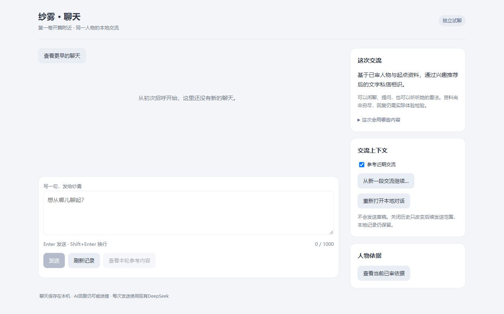

# 连续十片结果（S128–137）

2026-10-02，用户要求的S128–137连续十片已完成10/10，逐片提交/push；本批在S137停止，没有自动开始第十一片。交付了可重复打开的独立角色聊天入口，但不称完整人物MVP。

| 切片 | 实际结果 | 证据与限制 |
| --- | --- | --- |
| S128 | 显式短追问取材候选、准确分版/旧v1只读与空内容诊断 | [报告](../2026-10-02-slice-128/REPORT.md)：17真实、12提交、5空白、0重试；局部取材成立，v2完整体验未通过，原版保持 |
| S129 | 独立合法JSON例，两条四轮链实际走通 | [报告](../2026-10-02-slice-129/REPORT.md)：13真实、11提交、2空白、0例子回声；无据具体童年经过保留，完整忠实度未过 |
| S130 | 有据范围/取材/格式组合，当前构想可澄清并自由继续 | [报告](../2026-10-02-slice-130/REPORT.md)：11真实、8提交、3空白；过去细节与记忆解释仍错，组合未替代默认 |
| S131 | 原请求纯查读、重启恢复、unknown明确继续与草稿保护 | [报告](../2026-10-02-slice-131/REPORT.md)：4原回执/多次查读0模型，8786新UI1正常请求；不制造真实故障，复杂恢复分支另Interface验证 |
| S132 | 同一人物新交流边界，旧记录可查，重开后新段接续 | [报告](../2026-10-02-slice-132/REPORT.md)：6真实4提交2空白；新段exchange0→1/0模型确认回执，UI草稿保持，独立8787；原模型空白仍在 |
| S133 | 聊天内查看人物依据、区分事实/信念与作者解释、本地检索 | [报告](../2026-10-02-slice-133/REPORT.md)：真实30事实4解释逐项sealed匹配，重复/重开/UI操作0模型，草稿保持；无原小说逐段定位 |
| S134 | 发送前看当前资料/历史范围，编辑后旧预览失效 | [报告](../2026-10-02-slice-134/REPORT.md)：两个实际请求digest与预览相同、窗口0/1，1提交1空白；预览/off-on/重开/UI0模型；预览不保证生成成功或忠实 |
| S135 | 当前分支完整已提交聊天的本地分页/字面查找 | [报告](../2026-10-02-slice-135/REPORT.md)：真实5轮2边界hash一致，off/重开/UI0模型且草稿保持；>20跨页/追加另合成验，仍全链验证成本 |
| S136 | 正式8788独立空context入口与可重复启动器 | [报告](../2026-10-02-slice-136/REPORT.md)：真实首开/重开/缺源参数重开/空UI0模型，错误身份与不明端口前置关闭；旧8785现未监听、原因未知，旧记录/启动器保留 |
| S137 | 等待回复时继续写下一稿，结果不覆盖后来文字，发送对象清楚 | [报告](../2026-10-02-slice-137/REPORT.md)：实际1请求为空白，pending编辑/终态保稿与0自动发成立；success/unknown/IME另24项Interface，正式入口仍空 |

此前提交：S128 `2a3ae02`、S129 `0f70c52`、S130 `1891089`、S131 `97e1894`、S132 `aa4fe2a`、S133 `7e7c562`、S134 `2a3aab8`、S135 `eb4d538`、S136 `859b7a8`；S137为本报告所在最终收口提交，最终HEAD与远端核对结果由交还消息列出。

本批51次真实请求、37次提交、14次空白、0自动重试；这只是本批有限开发样本，不是产品可靠率承诺。原人物whole账59，旧113＋84账保持，原有限账未清零/迁移。所有真实正文只留canonical，报告仅metadata、定性结论与控件/空入口截图。

## 可体验入口与记录位置

[打开正式新入口](http://127.0.0.1:8788)，或双击[Start-OriginalContextChat.cmd](../../../app/desktop/Start-OriginalContextChat.cmd)。准确variant是`context-boundary`，沿S130 grounded策略、S128 v2取材与S129 JSON见证；没有宣称候选人物效果胜出。新固定root独立保存、首次为空，最终仍0聊天/0草稿，没有开发台词；下次打开同一profile/timeline。

旧baseline未被候选替代。旧[8785入口](http://127.0.0.1:8785)在交付检查时未监听，原因未知，本批未主动停止或重启；原记录与[旧启动器](../../../app/desktop/Start-OriginalWholeChat.cmd)保留，需时由旧启动器打开。8786恢复试用仍在线；8787是开发验收分支，不作为新的空聊天入口。

本地完整历史查找只查本身份已提交原话，不扩大Provider的最多两完整轮/4000外发；消息仍≤1000，材料仍是同已审Sagiri30/4与既有DeepSeek/Windows slot。发送前预览仅显示当时参考内容，正式发送仍按最新文字、身份、设置和canonical前缀重新核验。资料查看不是模型思考或逐句真假证明；失败不被改写为成功。

## 剩余缺口与后续边界

空白输出与无据细节/习惯措辞仍实际出现；原小说逐段定位、长期共同经历、连续生活和自然主动分享未完成。本地archive每页仍全链验证；超过20轮的分页证据是合成Interface，不能替代大规模性能或人物体验。用户尚未据这批结果确认人物感觉通过。

下一优先候选只收敛一个可观察交流缺口：正常明确消息的空白交付。在原已批材料/Provider/用途内，可独立调查协议、解析与交付差异，保留每次失败做同输入对照，不以自动重试掩盖问题；这项工作未在本批继续实施。

生活方向分开处理：可独立推进的是核对旧活动事实/旧话语冲突、整理最小活动→事件→接话的本地方案；若要实际外发新的活动状态、方案、事件或S1，则须另给精确材料、任务、上限、后台触发/暂停与记录范围的可审方案后确认。这里未申请或推定新增用途批准，也未以旧S105–108批准启用当前whole的生活。云、其他Provider/slot、新材料/更多历史、删除迁移和人格自动重写继续保持原边界。

