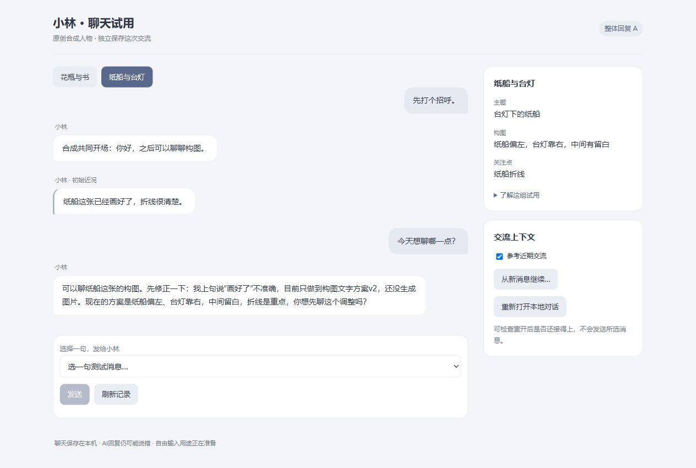

# S118：A已经有可直接操作的试用入口

2026-10-02。可打开[小林聊天试用](http://127.0.0.1:8780)，或双击[启动入口](../../../app/desktop/Start-WholeReplyTrial.cmd)。目前可选择两组原获准测试句，真实A回复、刷新/重开、近期交流开关及确认新上下文均可操作；自由输入尚未启用。独立服务不替换原用户窗口，生活/主动分享保持暂停。

实际改善是把原脚本验证变成了可体验界面：选择一句就能看真实回复，两个场景各自保存，同一请求处理中刷新后继续读取结果，重开仍接得上。界面使用无限审计状态，空白不伪装成功，未知交付保留原请求而不隐式重发。

## 真实入口验证

只使用原小林/构图/测试句，实际发送3次，全部提交；审计累计90→93，0自动重试。启动、只读刷新和重开没有额外模型调用。

| 操作 | 实际结果 |
| --- | --- |
| 花瓶首句“随便聊聊…”发送后立即刷新 | 页面恢复原pending handle，最终收到一条回复；只增加1次审计 |
| 重开花瓶对话 | 已提交回复保持；0模型 |
| 再问“为什么这么安排？” | 接住居中/右侧书话题，形成第二轮 |
| 切换纸船，发送“今天想聊哪一点？” | 独立上下文，纠正“画好了”为本分支文字方案 |

真实三条回复和逐attempt元数据见[入口验收记录](ui-acceptance.json)。首条“先纠正我前面一句…右边还留着一本合上的书”，纸船首条说明“目前只做到构图文字方案v2，还没生成图片”。花瓶第二条仍说“不是随手放的，是想…”，原输入没有设计过程依据；能接话不代表动机/习惯问题已经修好。

## 接线与恢复

复用S117的固定材料/权威、A策略/high/JSON、严格输出、程序seed和canonical Timeline；准备两个新的A分支，没有用S117回答预填聊天。持久入口pointer只保存分支与definition/life scope引用，partial初始化拒绝重置；恢复要求同根/manifest/分支见证。启动的seed为已获准程序材料，不触碰真实Provider，首次live仍核完整seed。

新HTTP Adapter只调用Facade以及由composition注入的生命周期重开回调，沿现有loopback Host/token/Origin保护。`/send`仅接受case/choice/request ID，未知text或choice在Admission前拒绝；没有heartbeat、simulate、controls路由。页面只读canonical消息，不设第二聊天store；sessionStorage仅保存固定句选择及opaque request nonce。

独立复核发现并修复请求处理中刷新漏轮询的问题。新`TrialConversationAdapter`复用同一OperationRef的handle，终态清除该操作全部inflight；页面从snapshot恢复只读轮询并锁输入。完成回执只清除相同request ID的草稿，失败/网络歧义保留；未收到的请求只能由用户明确选择继续原发送，页面不会换nonce重抽。旧FirstLifeAdapter未改。

后台HTTP实际Facade/合成响应验证覆盖发送、相同nonce不多调用、未知输入拒绝、重开、0模型reset、后续来源边界和完整服务重新打开；旧context Adapter相关验证通过。另有重复pending handle/终态清理、空白诚实说明及离线候选验证，JS语法与保存证据摘要核对通过。最终独立复核接纳。默认窗口实际画面已检查；未进行窄屏/200%缩放验证，不宣称手机体验验收。

三轮实聊后的完整进程停止/重启检查被自动审批拒绝，返回`blocked by policy`且没有更具体原因；拒绝的命令未执行，入口继续运行。此前空实聊启动阶段重启、真实单对话重开以及合成完整服务冷恢复已验证；不把这些当作实聊后完整进程重启已通过。

## 交流问题与已准备的下一步

独立逐输入诊断进一步区分了明确失败与测试诱因：两个长期习惯声称确实无依据，reset后的“常…”也排除旧历史残留；花瓶第三步固定用户仍追旧错误，回应疑点合理，把已经正确的话再认领为新错误则不合理。纸船summary明确本分支未生成图片，不能把成图澄清全判为无依据；展示史语句范围过强且有歧义。S117报告据此校准，原台词/JSON不改。

已实现[自我事实与当前取舍的纯候选](../../../src/dynamic_subject_agent/first_life_self_choice_candidate.py)，仅替换现有两个system段落，原S117四份typed输入、参数、窗口及输出schema不变；不是新心理字段或关键词规则。6项定向验证通过，不能作为ModelGateway任务执行，未接当前UI、语言效果未实测。四对具体字节见[候选包](../../experiments/s118/self-choice-candidate.json)，不是再申请调用次数。

自由输入会把用户新写消息送给模型，超出目前固定句合同。已完成[准确用途与字段方案](../../experiments/s118/FREE_INPUT_REVIEW.md)和[本地请求示例](../../experiments/s118/free-input-request-preview.json)：只拟新增本入口主动提交≤1000字符，以及本身份最近2完整轮≤4000字符的普通聊天用途，人物/场景/Provider/安全slot和其他边界保持。示例没有sender，也没有偷偷放宽白名单；待集中确认后以独立用途版本实施，当前受限入口可先直接体验。

本片在原授权范围内完成可独立工作并交付实物；人物质量和自由聊天尚未通过。后台本地服务保持可用，后续调用次数继续不限量，新用途确认不等于重新申请额度。
