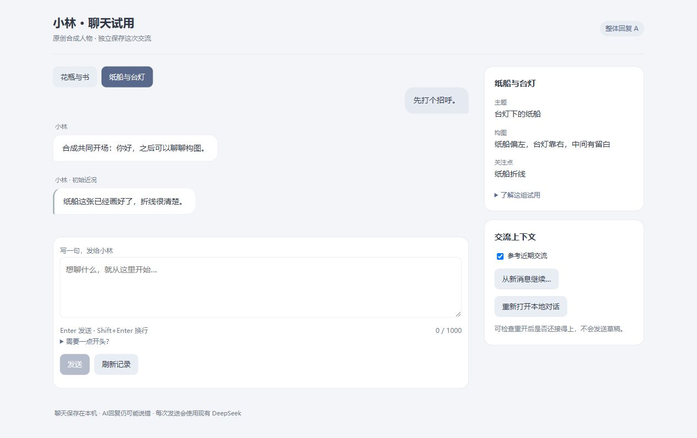

# S119：自由输入已可用，连续接话成立

2026-10-02。用户批准S118准确文字用途后，已交付[小林自由聊天](http://127.0.0.1:8781)，或双击[启动入口](../../../app/desktop/Start-WholeReplyChat.cmd)。可以自己输入≤1000字符，Enter发送、Shift+Enter换行；开启近期交流时，只用本身份最近最多2完整轮/合计4000字符，原设定、活动和S1范围保持。原8780固定句入口及记录仍可用，没有停止旧服务或迁移数据。

本轮实测四条不在旧清单里的普通问法，全部形成真实提交，0自动重试。处理中刷新只观察原请求，重开0调用且接住“刚才选的那部分”；关闭近期交流后仍能处理新问题。界面与必要用途边界已经成立，人物质量尚未全部通过。

## 真实连续结果

| 步骤 | 新输入/操作 | 实际结果 |
| --- | --- | --- |
| 1 | 问圆形/方形与安静；生成中刷新 | 原handle恢复，仅1请求，正文回答形状但先补旧花瓶纠错 |
| 2 | 选择方形，问边缘/位置 | 选择先聊画面位置，解释当前看法 |
| 3 | 重开后“先说刚才选的部分，给例子” | 沿位置讨论，举方形杯子在角落/中间的假设例子；非新生活事件 |
| 4 | 关闭近期交流，问蓝绿主色 | 直接选蓝色，并明确“只是我此刻的取向”，没有回放旧项目 |

这四句由开发编写，不是用户私人聊天。[完整原文](TRANSCRIPT.md)和[metadata/受控状态证据](owned-ui-acceptance.json)保留实际结果。导出器遇任何非本样本用户文字会停止，不把未来私人聊天自动导出到仓库。真实history-off操作与无额外调用成立；出站空历史/S1及4000完整窗口的精确字节边界另由合成行为验证，不冒充已保留所有真实私聊wire。

## 新授权与旧入口隔离

`FreeInputReplyTrial`拥有独立S119授权、manifest、策略digest/witness和固定根，只有A普通回复可用。人物/作者解释、相识公开前景、现有活动/方案/event及S1仍匹配原批准材料；当前文字和本身份canonical用户来源允许在新界限内变化。旧S117白名单、manifest和策略字节保持，旧entrypoint不能打开新trial。

`_whole`继续裁决typed完整来源、最多两完整轮/4000、S1/400和history-off；新的用户来源≤1000、对话中的人物回复来源≤1200。UI不可提交历史数组、附件或其它角色，过长/空白/null/错type在Admission前拒绝。关闭历史不物理删除记录，明确reset保持原确认与canonical边界。模型只生成一条提议，Python裁决后唯一Timeline提交，未新增人格/关系或文件effect。

新增观察器只留请求摘要、任务类型、安全错误/模型/用量等metadata，不保留私人prompt、request_body、final_content或回复正文的观察副本。实际成功对话仅canonical，未提交草稿仅浏览器sessionStorage；nonce绑定原提交文本，pending刷新只poll，匹配成功回执才清草稿，网络歧义保留原请求，不自动生成。

独立复核发现同库新purpose会使已运行S118旧reader拒读。已改为独立`free-input-audit`，仍limit=None、claim先落盘/一次性票据与目录外初始化见证；旧审计没有写新purpose。真实新用途4次，旧无上限开发审计仍93，两本此阶段无上限审计合计97，旧有限账保持历史；这不是分配新额度或第二canonical聊天store。新claim后旧8780仍available的实际结果已核对。

## 必要验证与实际限制

新用途/旧白名单并存、wrong scope/root/用途、其它人物/生活材料、B任务拒绝、完整配对/4000精确界限、history-off来源为空、private观察器过滤、metadata purpose及冷开恢复通过。后台新HTTP验证文本/UUID/附件/跨Origin拒绝、pending相同nonce、状态只读、draft/IME/Enter与匹配清理；S118入口生命周期默认值及相关旧live/S114兼容通过。独立复核确认审计并存修复后接纳。

一次开发fixture的短idempotency key被拒绝，改为既有16–256 token合同后通过。一次跨Origin测试用大emoji body在Windows出现连接中止，改用小body定向复验得到403；有效Unicode长度与保留原文的检查继续保留。没有据此宣布所有平台网络表现一致。真实整进程停止/重启的旧审核拒绝未绕过；本轮采用新端口/新根，并验证真实对话重开与合成完整服务冷恢复。

首轮明确说“聊点新的”仍被旧花瓶纠错抢先，说明当前提示会过度关注旧错误。后两轮接话与条件例子自然些，但四次成功不足以证明不会再空白、编造习惯或动机。S118“自我事实/当前取舍”候选保持离线未启用，本轮没有把UI接通说成其语言修复已成功。

下一步继续同已批准用途的普通对话和S118单一候选比较，优先让当前话题决定要不要修复旧话，并区分定义事实、当前意见和长期习惯；不为旧错误补人物定义、不堆心理字段。次数无需再确认；其它人物/更多历史/新Provider/云端等范围仍另按实际方案处理。

实现提交`9ca17e9`，报告与可用入口随后提交推送。证据规范摘要（排除自身字段）`59b1b27c8cdb066c8f9a6a3df5d688fc12cc57d098e0dc7627574927ba278b29`。
