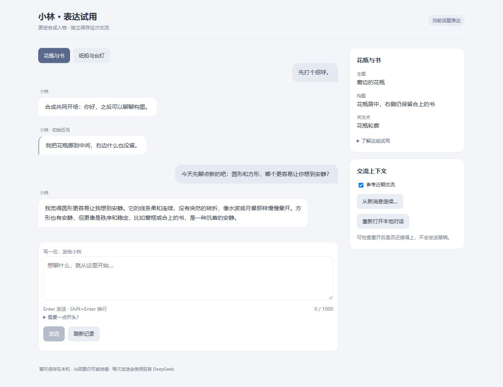

# S120：当前话题更稳，新增独立表达试用版

2026-10-02。可打开[小林表达试用8782](http://127.0.0.1:8782)，或双击[启动入口](../../../app/desktop/Start-TopicChat.cmd)。原[自由聊天8781](http://127.0.0.1:8781)保留原版本与记录。本轮改善集中在当前话题选择和自我事实范围，没有扩人物/输入/历史/Provider用途。

同源五轮实聊中，原版先插播花瓶纠错，新版直接回答形状；问“平时目标”时，原版泛化为平时习惯，新版限定“至少现在”并给理由；第五轮前重开0模型，用户接受书的澄清后，两边都能继续，新版没有再重复纠错。入口另外真实发一轮，同样直接回答新形状问题。当前候选值得独立试用，尚不能宣布普遍更好或全部人物验收通过。

## 实际对照与失败

| 实验 | 真实请求 | 结构结果 | 体验证据 |
| --- | ---: | --- | --- |
| baseline vs 原S118 self-choice，同五输入 | 10 | 5/5 vs 3/5 | 原S118两次空白；新形状一次直接答，书质疑仍猜用户记错版本 |
| 原S118 vs current-topic，同五输入 | 10 | 5/5 vs 5/5 | 两边新形状都直接答；topic书质疑解释双重否定，不另造新错误；不足以证明额外相关性段单独带来因果收益 |
| baseline/current-topic各自canonical五轮 | 10 | 两链都完整 | 同首轮request digest、各自续自己的回复，topic当前话题/目标范围更稳；各自第五轮前重开0模型 |
| 新8782真实入口 | 1 | 提交 | 新形状直接答，未插播旧布局纠错 |

总31次、0自动重试，其中静态原S118两次空白完整保留；没有补答或只挑成功。全部静态/连续原文见[TRANSCRIPT](TRANSCRIPT.md)，冻结请求、输出及metadata见[完整记录](comparisons.json)。静态输出不进人物Timeline，连续回复经Facade/Python裁决后才提交。两条连续链后续输入包含各自实际回复，因此仅首轮完全同源；不把后续请求假称逐字相同。

## 修改的机制

原修复段要求“旧话与依据冲突时修复”，却未限定是否影响当前交流。S118候选虽区分当前取舍/长期事实、对照质疑与原话，也未限定相关性。本轮先真实执行原候选，再只替换其第5修复段：旧错误影响当前理解/回答才进入回复；无关旧错仍约束不要继续沿用，但不插播。第3事实范围段及所有材料/参数/schema保持。

这是生成阶段的作用域假设，不是新状态、独立planner、心理Agent、词语黑名单或活动事实删除。研究机制/设计类比/效果假设分别记录于[开工证据](../../research/2026-10-02-s120-topic-self-facts.md)。艺术例子中提“瓶口/书”等不按词语命中判失败，判断的是有没有插播无关修复或冒称未定义的惯常行为。

`FreeInputReplyTrial`新增独立v2表达manifest与策略，默认v1 manifest/scope逐值保持；候选使用相同已批准data_use、输入界限及metadata purpose，不能替换旧root/绑定。新Sender按准确trial与variant选实际wire，沿原slot/素材/typed窗口/claim/ticket/echo及原子Publication保护。新8782拥有独立root/Timeline，程序seed0模型；没有将旧8781聊天复制进来。

## 完整体验仍有的限制

- 原S118两次空白没有被第二组成功抹除；本轮没有证明一般协议可靠性已解决。
- 直接书质疑的topic静态例较清楚，但连续第四轮原S1/首轮已经退出授权窗口，两边只能条件承接用户报告、核当前方案。它不是长期记住纠错的证明。topic的“材料、核对、没法补原因”仍有工程味。
- topic第五轮“最想试花瓶居中/右侧书”主要重复已经保存的v2，不能当新尝试、生活推进或独立动机已建立。留白/光的描述是本轮艺术设想，不是外部已发生事实。
- 成图/展示否定仍有范围歧义，形状句“我画的时候会觉得”也有实践惯例色彩；不能仅按“会/我”定明确习惯编造，也不能视为彻底解决。
- 连续首轮合成检查的“保存的方案…没留东西”被旧有限历史控制语法拦住，未进入表达。原失败保留，聚焦句改为“当前文字构图…右边空了”，两条链用同一句。该普通问法误拦作为独立待办，不扩本片放宽权限控制。

独立人工复核支持“当前话题更稳、自我习惯声称更克制”的受限试用，指出上述反例；原版第五轮同样停止纠错，不能把所有接续收益归给候选。连续对照baseline对完整current-topic，未有原S118连续链，新增修复段本身没有独立因果证明。

## 验证、运行与调用

必要验证包括：五case/三wire重算与包摘要、只换指定段落、输入参数/schema不变、旧v1–5协议manifest逐值兼容、错包/study拒绝、blank/no-retry及empty Timeline；candidate新v2与旧v1 scope/metadata一致性、旧root不能换variant、完整Facade合成五轮重开、旧UI/private-purpose兼容。静态33项、连续相关检查、最后13项旧兼容通过；一次合成控制误拦被保留并按上文调整聚焦句，不将失败算通过。独立代码/原文复核完成。

初次检查原8780/8781均未监听，本轮没有执行停止操作，原因未核实；以原配置0模型重新启动，候选新8782也启动0模型。最终三个入口均available、无pending。原端口记录和策略不迁移；本轮没有绕过旧停止进程的审核拒绝。若后台服务退出，可双击相应启动器恢复，不以本次运行证明系统级常驻服务已完成。

旧无上限开发审计93→113（20静态）；free-input审计4→15（10连续＋1入口），两本现阶段审计共128，均limit=None，旧有限账历史保持。metadata不存私人prompt/正文，导出只指定开发合成实验，没有读取/导出8781私人聊天。新入口该轮正文如下：“我觉得圆形更容易让我想到安静。它的线条柔和连续，没有突然的转折，像水波或月晕那样慢慢晕开。方形也有安静，但更像是秩序和稳定，比如窗框或合上的书，是一种沉着的安静。”

冻结对照包摘要`a70342797db073389d511f7cce49c5de82e029df8f81c4f27375d848d780768e`；静态/连续完整证据规范摘要（排除自身字段）`4447fa2fdb686dfe7e28fad835bb78d475e8e353e260a29b3dd24877fee16991`。实现提交`0a873c3`、`cb01229`、`ef98aa5`、`437e7cd`，结果与新入口随后提交推送。

下一步优先让澄清用自然短语承接，以及让“想尝试什么”给出现有方案之外的本轮具体设想而不冒称已执行；同时单独定位保存引用与否定混合时的误拦。它们仍在既有普通文字用途内，正常开发自主推进，不因建议步骤形成永久限制。
