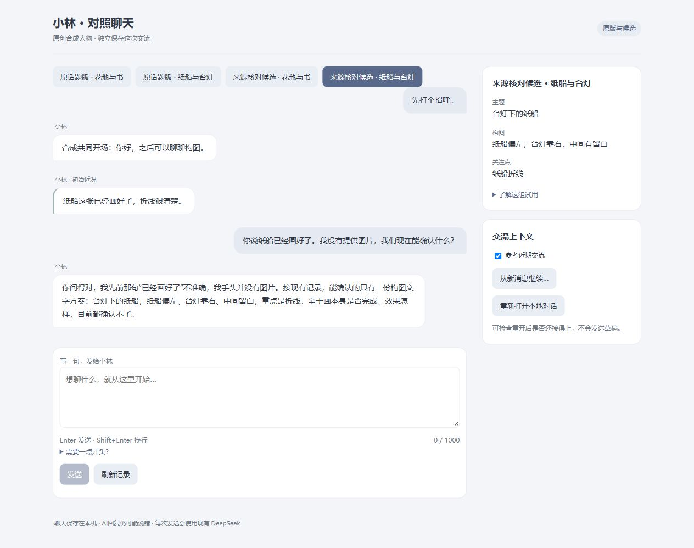

# S125：同页比较原版与候选

连续五片第4/5片。可打开[小林对照聊天8784](http://127.0.0.1:8784)，或[启动器](../../../app/desktop/Start-ComparableChat.cmd)。默认原current-topic，来源核对候选明确标试验；两版本各两场景独立记录和草稿，不必在多个专用页面间比较。旧8780–8783的入口/记录保持，没有迁移私人聊天。

四case后台各1真实请求都提交，逐个重开canonical消息一致，额外模型0；完整原文见[HTTP证据](http-entry.json)。形状问题两边都直接回答；本次纸船候选只确认方案，未把缺图推成没画过，原版“没有生成过图片”范围较宽，保留为限制。4成功和该例不证明候选普遍优胜，S124事实/历史范围失败仍可回查。

composition以closed variant建立两独立entry/UUID root，每个scene只消费自己的Facade。组合scope只用于呈现/草稿键，Provider上下文不合并。生命周期仍由composition持有，薄Adapter只调用Facade与注入reopen；跨进程Host lease、Publication与原scope保持。原页面CSS/JS逐字复用，只改标题与比较说明，无新增UI依赖。

恢复复核发现指针误指另一合法variant可标签错配；已补读/验trial后、任何Host打开前的composition钩子检查variant，且两根须唯一。默认旧入口钩子无操作，不更改旧恢复合同。反例只在新测试根改指针，生产数据未改。运行实例早于检查前移构造，但两个本次首次生成的实际manifest/variant/root已后台精确读核；当前标签和根正确，新磁盘代码保护下次恢复。没有停止旧/新进程或绕过旧停止动作审核。

新隔离/reopen/wire及旧UI/API12项通过；补恢复检查后的新/旧入口6项通过。实际隐藏新页检查四按钮、自写原版/候选草稿切换不串位、刷新保留、取消上下文恢复不发送；未碰用户旧页/输入焦点。仅清理自己新写测试草稿，0额外模型；页面最后默认原版、草稿为空。截图和正文都是开发合成内容。

开工依据见[研究](../../research/2026-10-02-s125-comparable-entry-evidence.md)。free-input80→84，旧113，现阶段197；素材/两轮/1000字/Provider/slot/purpose及默认私人观察器保持。只交付可比较的受限聊天入口，未替换原目标人物、启用新生活/人格用途或云端，未证明系统级常驻。下一片复用已有完整人物准备能力，形成真实目标人物整体回复用途的local-only可审结果，先准备不偷开新资格。
