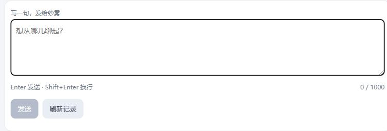

# S127：纱雾整体回复与连续试聊

2026-10-02。已把S126获批的原人物整体回复从用途准备接成可运行入口：[本机纱雾聊天](http://127.0.0.1:8785)，或运行 `app/desktop/Start-OriginalWholeChat.cmd`。独立空历史分支实际完成8轮、8次请求，全部提交、0自动重试；旧人物/小林入口及记录保持。这里只交付受限聊天试用，完整MVP尚未通过。

## 实际改善与体验判断

| 场景 | 实际观察 | 结论与限制 |
| --- | --- | --- |
| 初识与开放邀请 | 接住兴趣推荐后的文字招呼，主动选择角色设计取舍；不要求用户逐项选题 | 能聊具体话题，未朗读档案或运行回执；本组语气仍偏普通绘画讨论，不能据此认定人物辨识度充分 |
| 追问自己的理由 | 承接前轮轮廓、可爱感与设定的取舍，说明当下选择理由 | 两轮窗口可以支持短追问；没有证明长期动机或共同经历记忆 |
| 错误完成前提 | 能指出前面讨论的是取舍，不是已经完成的一张图 | 后半句仍可能扩大成对既有交稿工作的否定，范围歧义保留；未改写该回复 |
| 笔名 | 认识工作笔名并谈它与画的联系，没有机械否认自己知道 | 直接确认工作身份；初识时的披露分寸本组证据不足，不判全面通过 |
| 不同意见 | 对“所有插画表情都该夸张”提出不同看法，并解释情绪差别与画面目的 | 可以有当下立场；不证明持久人格或关系变化 |
| 历史关闭／再开 | 关闭后正常讨论颜色与留白；开启、重开后可承接自己的选择并举新构图例子 | 未伪称失忆，例子仍按构想表达；只支持批准的两完整轮，生活与长期相处未接入 |

输入和观察目的见[验收场景](../../experiments/s127/EXPERIENCE.md)。原消息与回复只在本地canonical Timeline；本报告不复制整段原人物聊天或请求材料。逐请求状态、长度、摘要和来源窗口见[metadata](experience-metadata.json)。没有同条件原版对照，本片不宣称整体回复在语义上优于旧两阶段。

## 实现与验证证据

新的 `original-character-whole-chat-deepseek-s127-1` authority/manifest/contract绑定准确definition、asset、persona、review与用途，独立于S126不可执行review、小林资格及旧两阶段资格。只有production composition装配provider-neutral Gateway和单阶段Sender；当前主动文字≤1000、本身份可关闭的两完整轮≤4000、最小人物材料，没有S1或活动／方案／事件。模型只生成表达候选，六Domain均NoOp，不写人格、关系或生活状态。

发送与最终Publication都核identity/history revision；关闭再开、身份切出再回仍取消旧候选。复用schema1原子Publication，已完成结果重取；冷pending（包括已claim但未提交）以0模型终态FailedClosed收口，不宣称schema3的prepared成功恢复。审计使用新的独立metadata目录/目的，旧账配置与行不升级。

- 开启时0调用、空历史；8轮每轮1尝试，8次同nonce重取都0新调用。实际8条审计均complete，旧无限审计仍113＋84，新原人物账8。
- 从canonical两完整轮和已审资产本地重建8次投影，摘要与真实claim逐项一致：历史关闭的第7轮exchange为0；第8轮重开后2完整轮194字符；每次生活evidence为空、core4/persona4，未选相关单元。此证据核DTO，不冒充保存了HTTP全包。
- P1复核发现缓存摘要标签不能替代内容核验：伪造内容保留获批标签可通过。已修复为完整重算封存内容并在每次Sender使用同一deepcopy快照；知识/人格/起点/身份四类篡改均0transport拒绝，票据不补发。前四轮是原样严格封存材料，原包SHA `05fbb0603e645fe8114ed48a134575d108792fd3ed94a77eafdaaaab96c72199` 保持。
- 精确核对本轮自建helper的PID、路径、命令行及4轮已终结状态后停止并重开新版同root，4条回复摘要一致、0调用；另在第8轮前和UI中composition重开，记录一致、0调用。没有操作旧服务，也没有重试S118被拒绝的旧服务停止动作。
- 新材料/Gateway/Publication/history与旧审计、旧S126准备等整合组67项通过；入口恢复补丁冻结后最终9项HTTP/lifecycle/Node检查通过。实施所有者另完成旧两阶段／生活与Publication兼容组，独立复核接纳。`git diff --check`通过；测试不是人物体验的替代。
- 后台新页显示8轮；自己新写的未发送验收草稿经刷新和重开保持，随后仅清理自己的草稿，计数仍8。已知终态失败清原nonce但留文字，下一次须用户明确发送；网络、unknown、pending保留nonce，仅重取，不自动重发。IME与草稿恢复经Node验证，未操作用户旧草稿或输入法。

下图只含输入控件，不含canonical聊天正文：

## 未解决与下一步

人物辨识度、外部事实否定的范围、初识披露分寸仍需连续反例验收。下一步优先沿同一已批准用途核对人物认识与自然澄清，依据实际错误调整取材或表达，再看完整对话；不通过加规则或测试数宣布改善。长期共同经历、生活进展和主动分享仍是最终目标，本片尚未实现；原人物whole新增生活／S1用途须先形成具体可审方案，不能借旧小林用途启用。schema1未提交回复遇中断会失败关闭，用户需明确开始新轮。

本片按团队策略由一位所有者贯通强耦合资格/Runtime/Provider，另一位负责薄入口，独立只读复核发现并验证P1修复；root接纳关键差异、完成真实体验、UI和审计核对。没有新依赖、外部部署、凭据扩用或数据迁移。两个开工前未跟踪目录保留，合成测试临时文件保留在忽略目录。
