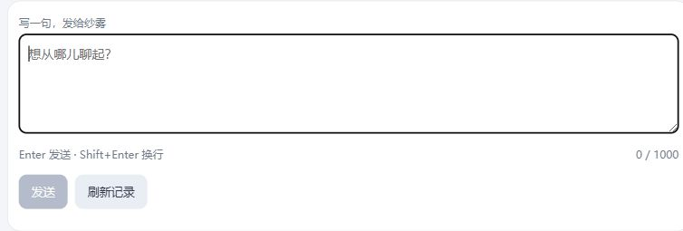

# S131：原请求纯查询与安全恢复

连续十片4/10，2026-10-02。新增Facade `lookup_subject_request(SubjectRequestLookupRequest)`，外层found/not-found/unavailable/failed-closed与原operation状态分开；只在scope、原消息指纹、Admission索引和全Publication完整性都验证后返回原结果。Host同canonical store独立readonly连接/单snapshot，不进入worker、submit/follow/wait、初始化、恢复、claim或写者。合法opaque16–256键可查，不新增Adapter key前缀永久限制。

页面刷新、轮询、重开和“读取原结果”用pure query，重启不依赖旧handle。查询失败不清nonce，原文不匹配不返回正文；已核canonical本地终态UNKNOWN才有两步明确放下，保留草稿/原attempt/用量，下一次用户点击才新请求。verified not-found不自动发送；同文下次明确发送沿原nonce防迟到重复，改文才新nonce。保留已知终态/IME/scope与后来改写草稿保护。

真实验证：S130四条已提交回复按原nonce反复读取，摘要一致，完成的16次查询含wrong/missing/foreign及重开，模型计数49→49；前置另12次成功读取也零模型。指纹变更fixture须经既有command factory重算，未改原记录。独立8786空历史后台服务0调用启动，页面一次明确普通发送成功，审计49→50；后续刷新、composition重开、草稿保持/清理自己的验收稿均0新增。没有操作原8785/用户旧草稿，正文仅canonical。

必要检查覆盖0Admission/claim/model、模型busy时即时pending快照、冷pending只观察、foreign/mismatch/lost-index/digest损坏、canonicalUNKNOWN与查读自身失败、旧legacy与入口恢复；23项整合及opaque修正3项通过，独立复核/实际metadata/差异检查接纳。UNKNOWN/故障与响应丢失分支使用合成Interface/Node行为验证，未制造额外真实网络故障，也不冒称这些分支都真人实测。

开工source及取舍见[研究](../../research/2026-10-02-s131-request-recovery-evidence.md)，真实证据见[metadata](recovery-metadata.json)。原人物账50，本批42真实/32提交/10空白，新增本片1正常请求/0重试；旧schema、Provider/slot/素材/模型政策和旧variant保持。下面仅输入控件、不含聊天正文。

恢复操作不修复人物细节与上游空白；下一片明确本地交流边界，使重新开启历史也不复活边界前旧轮。新人物/资料/更多历史、生活/S1、云端、凭据用途、删除迁移与人格重写仍未扩权。
