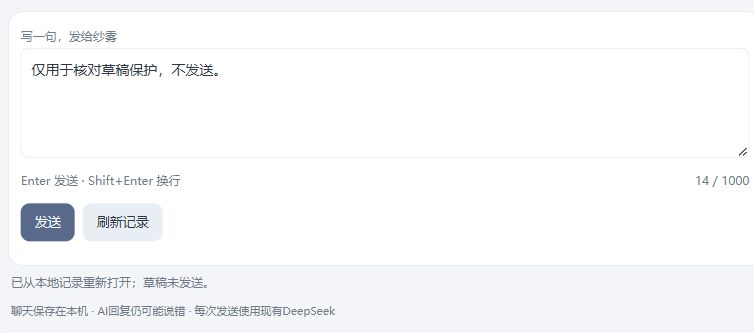

# S132：同一人物的新交流边界

连续十片5/10，2026-10-02。现在可明确确认从新一段交流继续：此前聊天仍能查询，人物与历史开关保持，之后取材不再跨过边界。不是删除、失忆、换人物或重新相识。

独立context authority/manifest/schema4仅新增两张本地控制表，确认经Facade和同canonical唯一写者以typed NoOp Publication原子提交cutoff/revision/receipt。系统head由完整链、边界记录和commit receipt四项basis核验；旧终态失败须有冻结前缀证明。pending及时拒绝，确认线程不持registry锁等worker，最终提交重核token。新root直接从精确freeze进入新合同，不先旧select创建schema1；旧schema/root/服务无迁移。准确机制与取舍见[研究](../../research/2026-10-02-s132-whole-context-boundary-evidence.md)和[架构](../../ARCHITECTURE.md#slice-132同一人物的新交流边界)。

真实同一分支完成两轮构想讨论→本地边界→新话题两轮。中间两个不同的入门建议输入均收到`response-content-empty`，终态失败保留，未自动重试；之后明确发送配色偏好新话题及追问，正常提交。共6真实/4提交/2空白/0自动重试。边界后三个首轮尝试的exchange均为0，成功后的追问为1；所有实际请求digest与按cutoff重建的最小投影吻合，`has_prior=true`。旧内容哈希不变，关闭/开启历史及进程重开均0模型，边界继续有效。小样本证明边界和接续行为，不证明模型可靠性、艺术判断或人物忠实度全面通过。

独立8787入口实际验证了预览→取消、重新预览→明确确认、composition重开；自有未发送草稿与history值保持，四条聊天原文保留。UI又建立一个零模型边界，最终revision2/cutoff6；该变化不回写此前真实验收记录。草稿验收后只清理自有测试文字，旧8785/8786及其他旧服务不变。刷新只查原确认，已核failed-closed/conflict可明确放下本页确认后重新预览；结果未知保nonce，不据全局revision猜成功。正文只留canonical，见[metadata](experience-metadata.json)。

必要验证：固定源52项覆盖新CTX9、grounded、原请求查询、既有life Publication与legacy只读，另2项权限/主链；入口13项Interface/HTTP/Node及最终Node修正通过。定向故障中发现并修复缺boundary记录时启动未闭锁、失败的SYSTEM输入误读utterance两处问题；提交前/后中断、旧控制完整证明、新控制阻断、pending锁序与最终history revision变化均受测。故障和响应丢失是合成验收，不冒充真实网络故障。协调方限定只读审查与独立入口负责人对稳定core的最终复核均完成，无新增阻断；实际完整链和UI结果由协调方接纳。

原人物账56，批次48真实/36提交/12空白/0重试；旧113＋84账保持。单片采用一个核心写入者贯通强耦合Timeline合同、一个入口写入者及协调者实际验收；开发模型/用量未从工具参数推测。下一片补聊天内人物依据核对，仍不新增生活/S1、更多历史、Provider/凭据用途、云、删除迁移或人格关系写回。
