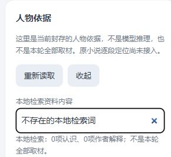

# S133：在聊天里核对人物依据

连续十片6/10，2026-10-02。聊天入口新增按需查看人物依据：起点、封存认识、组织单元与其支持认识、作者性格解释分层呈现，区分事实/人物信念及事件成立/本人知情范围。可以本地检索和收起，普通聊天不被资料清单替代。这里展示已审封存资料，不是模型推理、本轮全部选材或回复真假判断；原小说逐段定位未保留，界面明确告知，未虚构引用。

Facade `query_character_basis()`通过Authority每次重新核对当前身份/timeline、准确QRI/envelope，回程再次核当前scope；closed/切换/腐坏返空状态，不用旧loaded缓存。只读能力不进入worker、不等网络锁，不修改资格、Timeline、人物定义、历史开关或Gateway/Provider投影。来源与取舍见[开工研究](../../research/2026-10-02-s133-character-basis.md)。

实际自有8787分支：30项事实、0项belief、4项作者解释，以及核心4/经历4/细节2的内容和支持关系逐项等于当前sealed资产。重复读取与composition重开后三次HTTP读取一致，0模型，canonical历史、S132边界与历史开关不变，whole账保持56。记录只含数量与摘要，见[metadata](basis-metadata.json)，没有把人物正文或聊天复制进报告。

核心必要6项整合通过，含3项新Interface及schema4主链/旧composition兼容；覆盖聊天台词不加入basis、0额外调用/写入、重开、closed空结果、模型inflight期间及时只读、换active身份及篡改资产不返旧内容。真实包没有belief条目，belief语义分层不能被记成已在此真实包中观察到。

入口15项Interface/HTTP/Node及独立稳定core只读复核通过。隐藏实际页面打开30/4资料，对具体角色名本地检索得到1项认识/1项作者解释及相关组织支持；无匹配时0/0，重新读取/收起后自有草稿、history=true与4条聊天保持。模型账仍56；验收后只清自有测试草稿。以下截图只含控件与范围说明，不含人物或聊天正文。

本片新增真实模型调用0，批次仍48真实/36提交/12空白/0重试。它提供可用核对路径，未自动修正人物定义或既有错误回复，人物忠实、模型空白和完整生活MVP缺口保持。下一片准备发送前的实际范围预览；不增加原素材、历史、生活/S1、Provider/凭据用途、云、删除迁移或人格关系写回。
