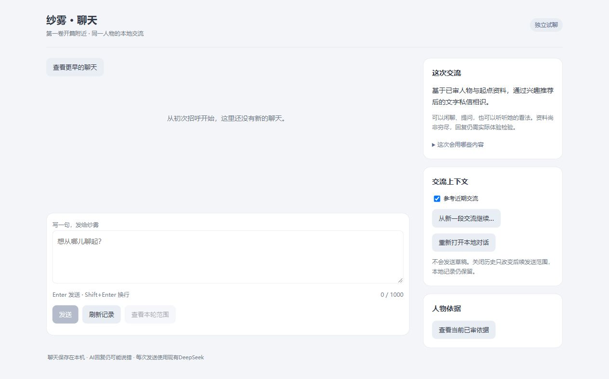

# S136：独立空历史的新交流入口

连续十片9/10，2026-10-02。可双击[新启动器](../../../app/desktop/Start-OriginalContextChat.cmd)打开[8788新入口](http://127.0.0.1:8788)。准确variant为`context-boundary`，沿grounded策略、v2 selector与JSON格式见证；health为`original-character-context-chat-s136`。新固定root是`%LOCALAPPDATA%/DynamicSubjectAgent/original-whole-context-chat/entry`，首次空记录、之后回同一profile/timeline，没有预灌开发台词，也未以候选替换旧baseline。

复用既有Entry生命周期，首次纯review后才建root，freeze直接进入context资格、不先旧select；新version/pointer严格绑定独立scope。existing与reopen在Host/冷恢复前经production→Authority纯核profile/timeline/准确variant，并显式把保存的identity_id传给activation，防止错误身份先写再拒绝。残缺、错误witness保留现状关闭。只有明确ConnectionRefused才进入创建，HTTP失败、非JSON、null或timeout不能被当空端口；不杀占用者。旧Entry默认hook/marker/root/variant/CLI与旧启动器保持。

实际新root不存在→首次为空→composition重开身份/空记录相同→用不存在的来源参数重新打开成功，registry字节不变，boundary revision0/cutoff0。只读依据30/4、archive0、预览history0/has_prior=false均成立，0模型。真实Windows空端口约2.08秒才给出ConnectionRefused，原1秒探测先超时导致CLI安全退出；定向修为6秒后实际8788成功bind，仍不放宽timeout判定。隐藏页面确认空聊天/空草稿、history=true、空稿不能发送；没有任何新台词。见[metadata](entry-metadata.json)。

必要6项新旧生命周期、CLI定向复验及20项入口检查通过。独立复核发现并解决wrong pointer/active在open后才比对、不可核health被当空端口两处风险，最终稳定源码复核和根窗口只读health/status均通过；实际验收没有制造错误生产身份或修改旧root。研究见[入口准备](../../research/2026-10-02-context-entry-preparation.md)。

**旧入口当前事实**：原[8785入口](http://127.0.0.1:8785)在本片只读检查时未监听，原PID已不存在，原因未知；本批未主动停止或重启它。旧记录与[旧启动器](../../../app/desktop/Start-OriginalWholeChat.cmd)保留，需时可用旧启动器打开。S131独立8786仍在运行。不能把“旧数据未迁移”写成“全部旧服务仍在线”。

本片0模型，whole账58，批次50真实/37提交/13空白/0重试。新入口仍是受限聊天试用，人物忠实/空白与生活闭环未完成；下一片只收口等待期间继续写草稿的实际体验与整批交付，完成S137后停止。
