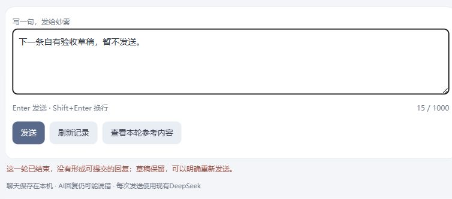

# S137：等待回复时继续写，十片交付收口

连续十片10/10，2026-10-02。同页保存的原request_id与当前pending一致、scope可核时，可以继续编辑下一条草稿；发送、历史开关、边界确认与重开仍受各自门禁。原request_text/nonce不被后来文字替换，没有发送队列、自动连发或自动重试。成功仅清仍未改且非IME composition的原稿，失败/unknown保留后来文字与原恢复规则，同scope composition暂空不会被旧稿回填。

范围说明改为用户可理解的“查看本轮参考内容；发送时按最新文字和设置重新核对”。Facade仅两句展示文字改变，不进入Provider policy、projection或digest。24项入口Interface/Node检查及独立稳定差异复核通过，覆盖success/blank/unknown、同nonce pending、scope与IME；这些不全是实际模型观察。

唯一真实观察在自有开发8787完成：原请求处理中、尚为5条旧提交时，textarea可编辑，发送与history仍禁用；输入不同下一稿后，模型返回`response-content-empty`，没有新提交，后来草稿仍在且没有发送。原输入重建的projection_digest与实际Provider metadata一致，证明后来草稿没有进入这一请求。旧5轮hash保持，随后只清理自有测试文字。**本轮不是一次真实成功回复**，success/unknown保护由上述Interface验证；真实1请求/0提交/1空白/0重试。见[metadata](draft-metadata.json)。

根窗口在此真实观察后指出“重新发送”可能误导为重发原请求，最终仅将已知终态反馈改为“当前草稿保留；点击发送会提交输入区的当前文字”，完成局部语法/diff检查，未重复模型调用。截图/metadata保留修改前的真实观察，不补造一轮成功。

正式8788经准确owned PID/命令行、空history及pending=false核对后加载最终代码；profile/timeline与S136摘要相同，仍0聊天、0草稿、boundary revision0，未预灌开发台词。最终页面见下图。一次合并状态检查与重启的工具命令被自动审查拒绝；独立只读核实后，更窄的同工具owned PID操作获得允许，没有改用其它停止通道或变更数据root规避限制。

本批最终51真实/37提交/14空白/0自动重试，whole账59，旧113＋84账保持。原旧8785当前未监听，原因未知；本批未主动停止/重启，旧记录和启动器保留，8786仍可用。本批在S137停止，不建立第十一片；可用入口与完整限制见[十片交付](../2026-10-02-batch-128-137/REPORT.md)。来源见[输入体验研究](../../research/2026-10-02-next-draft-experience.md)，原用途、canonical与生活/人格关系边界均保持。
